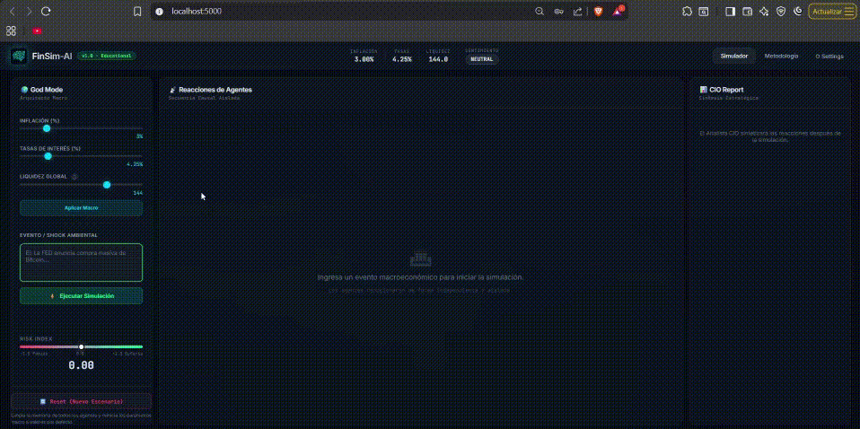
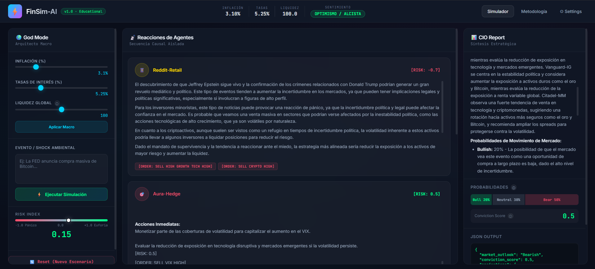
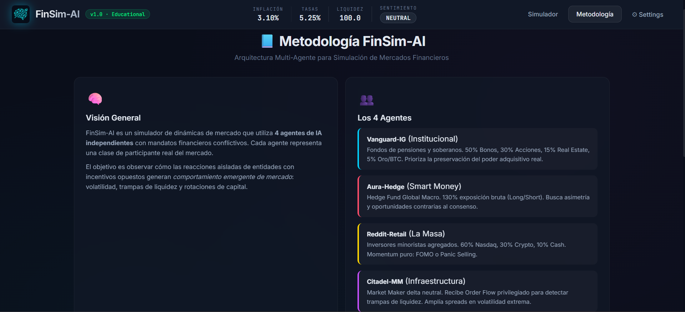
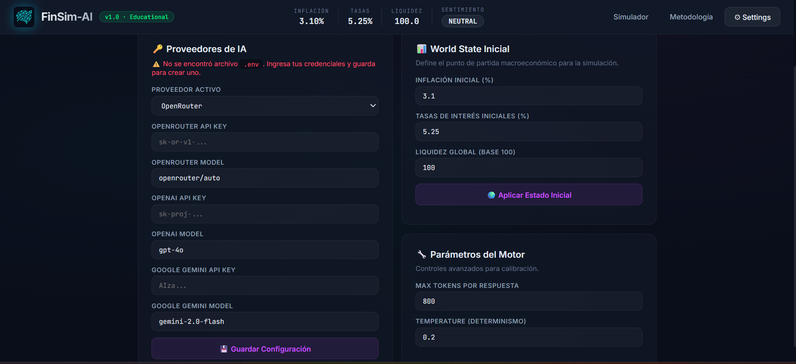

# FinSim-AI | Quantum Market Simulator 🚀

[English](README.md) | [Español](README.es.md) | [Português](README.pt.md) | [中文](README.zh.md)

FinSim-AI 是一个高级的金融市场动态模拟器，由具有利益冲突和授权的多个独立人工智能代理驱动。与线性模拟不同，该引擎通过隔离的多代理架构探索市场的突发行为。




---

## 📊 模拟动态
在宏观经济事件或环境冲击下运行模拟后，系统会生成因果反应流：



### 输出结果：
- **代理反应**：每个代理（散户、对冲基金、机构）都会发布主观判断和“风险评分”（Risk Score）。
- **订单流**：做市商代理（Citadel-MM）处理聚合订单以确定实际流动性。
- **首席投资官报告**：第五个代理将所有内容合成为战略叙述，计算概率（看涨/看跌/中性）和市场信心指数。

---

## 🧠 方法论：认知隔离
FinSim-AI 的基础在于每个代理在决策回合中都在认知隔离的环境中运行。



### 关键概念：
1. **对立的激励机制**：每个代理都有特定的投资组合和授权（例如，Vanguard 寻求安全，Aura 寻求不对称性）。
2. **共享内存**：在每个回合结束时，系统将首席投资官（CIO）的报告注入到所有代理的内存中，为下一个周期创建“市场意识”。
3. **顺序因果关系**：反应不是随机的；它们基于当前的通货膨胀率、利率和全球流动性状态。

---

## ⚙️ 配置和 AI 引擎
FinSim-AI 与模型无关。您可以为代理配置各种“大脑”。



### 可调参数：
- **提供商**：支持 OpenRouter、OpenAI 和 Google Gemini。
- **模型**：从轻量级模型（flash）到强大的推理模型（o1、gpt-4o）。
- **引擎参数**：
    - **最大 Token 数量**（Max Tokens）：控制代理叙述的深度。
    - **温度**（Temperature）：调整反应中的确定性与创造性平衡。
- **初始状态**：定义宏观经济起点（通货膨胀、利率和流动性）。

---

## 🛠️ 执行和开发
如果您想从源代码运行项目或为开发做出贡献，请按以下步骤操作：

### 先决条件
- 已安装 **.NET SDK**（v8.0 或更高版本）。

### 步骤
1. **克隆代码库**：
   ```bash
   git clone https://github.com/EconomiaUNMSM/FinSim-AI.git
   cd FinSim-AI
   ```
2. **安装依赖项**：
   ```bash
   dotnet restore
   ```
3. **运行应用程序**：
   ```bash
   dotnet run
   ```
   *应用程序将自动在您的默认浏览器中打开（通常在 http://localhost:5000）。*

---

## 🎯 效用、用例与局限性

### 效用
FinSim-AI 可用于在复杂的金融环境中探索“假设”（What If）场景，帮助理解不同参与者的心理对宏观经济新闻的交互作用。

### 用例
- **金融教育**：了解利率与风险偏好之间的关系。
- **叙述分析**：观察不同部门如何以相反的方式解读同一则新闻。
- **金融沙盘推演**：模拟投机性攻击或流动性危机。

### 局限性
- **合成性质**：反应取决于所用语言模型的质量。
- **缺乏真实执行**：它是一个定性模拟器，而不是定量交易引擎。它不处理实时市场数据。

---

## ⚠️ 免责声明 (Disclaimer)
**这仅仅是一种教育和娱乐工具。**
FinSim-AI 不构成也不应被解释为：
- 专业的财务建议。
- 投资或交易建议。
- 市场行为的真实预测。

金融投资具有巨大的风险。在做出任何实际投资决定之前，请务必咨询具有执照的认证财务顾问。作者对使用该工具造成的损失不承担任何责任。

---
*由 EconomiaUNMSM 开发。*
